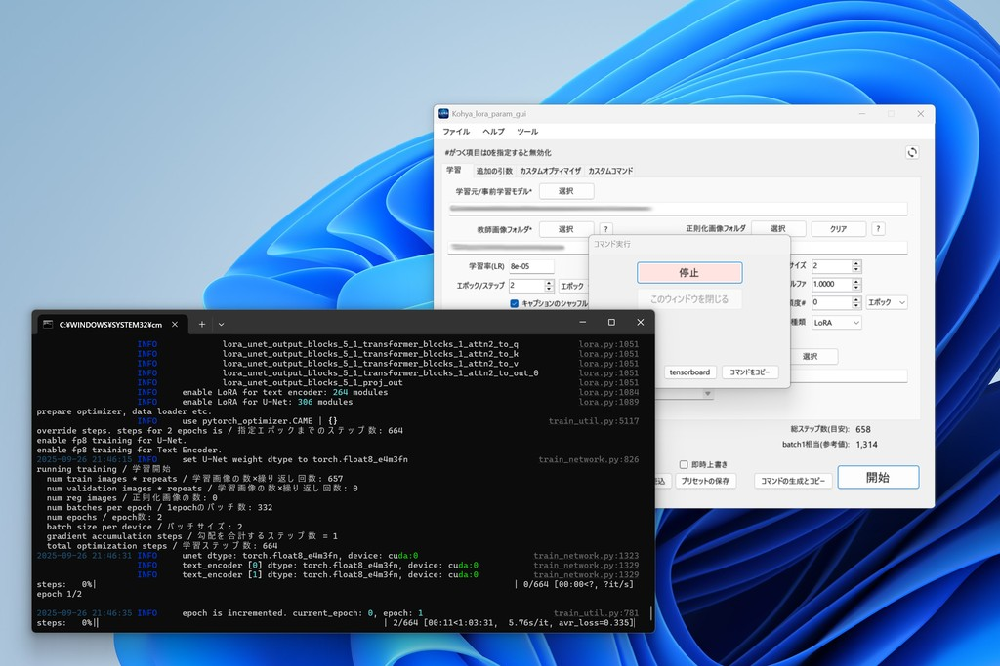

# kohya_lora_gui_krea2




# Krea 2 対応パッチについて

これは [RedRayz/Kohya_lora_param_gui](https://github.com/RedRayz/Kohya_lora_param_gui) に対する非公式の追加パッチです。
Krea 2 (K2) のLoRA学習をGUIから行えるようにする変更が含まれています。

**本家のKohya_lora_param_guiにはこの変更は含まれていません。** 本家開発者(RedRayz氏)にこのパッチについて問い合わせるのはご遠慮ください。不具合はこのパッチの導入元にご連絡ください。

## 前提条件

このパッチは [kohya-ss/sd-scriptsのFork](https://github.com/tk0298/sd-scripts) 側にKrea 2用の学習スクリプト一式(`krea2_train_network.py`および`library/krea2_*.py`, `networks/lora_krea2.py`)が導入済みであることを前提としています。GUI単体では学習できません。

sd-scripts側のvenvには以下が必要です。

* `transformers >= 4.57`（Qwen3-VLのサポートに必要）
* 上記に合わせて `diffusers` も最新版に更新（古いdiffusersは新しいtransformersと非互換のためimportエラーになります）
* RTX 50xx (Blackwell, sm_120) 世代のGPUを使う場合は、CUDA 12.8以降でビルドされたPyTorch
  ```
  pip install torch torchvision torchaudio --index-url https://download.pytorch.org/whl/cu128
  ```
* (任意) Windows用Triton。`pip install triton-windows`。無くても学習は動きますが、入れていないと`triton not found`という警告が出ます(動作に支障はありません)。

## 追加された項目

### モデル選択

「モデルタイプ」のコンボボックスに **Krea2** が追加されています。

### パス関連（既存の欄を流用）

| GUI上の項目 | Krea2での用途 |
|---|---|
| 事前学習モデルのパス | Krea 2のDiTウェイト(raw.safetensors等) |
| VAEのパス | Qwen-Image VAE |
| Qwen3 TEのパス | Qwen3-VL-4B Text Encoder（Animaと共用の欄です） |

いずれも必須です。指定が無いか、ファイルが存在しない場合は学習開始前に警告が出ます。

### 詳細設定 → 「Anima/Krea2」タブ

Animaと共用のタブです。以下の項目がKrea2でもそのまま使えます。

* スワップするブロック数（block swap、VRAM節約用）
* Timestep Sampling（`shift`または`sigmoid`推奨）
* 離散フローシフト（Timestep Sampling = Shiftのとき使用。K2公式では1024x1024で2.5前後が目安）
* Sigmoid Scale（Timestep Sampling = Sigmoidのとき使用）
* **fp8_scaledを使う(Krea2)** ← 今回新規追加したチェックボックス。DiTを動的スケールfp8で量子化し、VRAM消費を抑えます。Krea2選択時のみ意味を持ち、他のアーキテクチャでは無視されます。

なお、Self/Cross-Attention LR、MLP LR、LLM Adapter LRの各項目はAnima専用です。Krea2のLoRA(全Linear層を対象とする単一ストリーム構成)には対応する概念が無いため、Krea2選択時は無視されます。

### 対応モジュールタイプ

Krea2は現状 **LoRA / LoRA-FA のみ対応**です。LyCORIS・DyLoRA・LoHA・LoKrを選択した場合、学習開始前に確認ダイアログが出ますが、動作は保証されません。

### 層別学習非対応

Block Weight / Block Dim(層別学習)はKrea2の構造上サポートしていません。有効になっている場合は無視される旨の確認ダイアログが出ます。

## 既知の制限

* Turbo版チェックポイントでのサンプル生成切り替え(RAW学習→Turboで画像生成)には対応していません。RAWで学習し、生成時にTurboチェックポイント+保存されたLoRAを使う運用は問題なく可能です。
* GUI側のLoRAファイルサイズ予測はKrea2の実際のモデル構造(全263個のLinear層)から解析的に算出した値を使用していますが、実測値との照合はまだ行っていません。

## 動作確認について

このパッチはC#側のビルド確認・実機での動作検証を継続中です。エラーが出た場合は、エラーメッセージとともに使用したコマンドライン(生成された`accelerate launch ...`の全文)を添えて報告してください。
